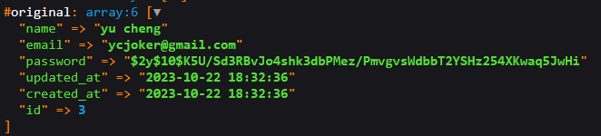

## About this project

This project is a demo web application built on Laravel. Laravel takes the pain out of development by easing common tasks used in many web projects, such as:

## Files
- [PHP tests config file](phpunit.xml)
- [NPM Dependencies](package.json)
- [PHP Dependencies](composer.json) 
  - Use `composer update` to update packages based on [composer.json](composer.json), and updates in [composer.lock](composer.lock).
- [PHP Dependencies (version LOCKED)](composer.lock)
  - Use `composer install` to install packages based on this file.
- [Vendor - PHP packages (like node module)](vendor/)
- [Artisan - Laravel console CLI](artisan)
  - Use `php artisan` for more details
- [Application Configurations](.env.example)
  - The actual *.env* file should not be exposed

## Simple Authentication
Using the official [Laravel Breeze](https://github.com/laravel/breeze) package, we can implement authentication features, from login, registration, password reset to email verification and password confirmation.

Installation, go to the application root folder or where the *composer.json* file resides. Execute the following command.

```sh
composer require laravel/breeze --dev
```

Once finished, we should see "laravel/breeze" being added in *composer.json*.
```json
    "require-dev": {
        "fakerphp/faker": "^1.9.1",
        "laravel/breeze": "^1.25",
        "laravel/pint": "^1.0",
        "laravel/sail": "^1.18",
        "mockery/mockery": "^1.4.4",
        "nunomaduro/collision": "^7.0",
        "phpunit/phpunit": "^10.1",
        "spatie/laravel-ignition": "^2.0"
    },
```
Next, we should run `breeze:install` command of *artisan*.

```sh
php artisan breeze:install
```

There will be many changes made on the existing files, along with some new files created.

For instance,
- [Tailwind css config](tailwind.config.js) is the configuration file for the tailwind CSS framework.
- [Postcss config](postcss.config.js) is the configuration file for postcss tool that transforms styles using JS plugins.
- [Auth views](resources/views/auth/) stores the views for authentication related actions like login, registration...
- [Auth routes](auth.php) implements the routing logic for authentication related actions.


Before we can use the authentication services, we must ensure the database is running. We can easily do this by running the command `php artisan migrate`.

**Note**: Make sure *a mysql server* is running and *php-mysql* is installed in the machine.

In this project, a mysql server was configured using [docker-compose.yaml](docker-compose.yaml).

```sh
docker compose up

# sudo apt-get install php<version>-mysql
sudo apt-get install php8.1-mysql
```

Also, ensure that the database configuration in the [.env](.env) file is correctly provided. Now run 

```sh
php artisan migrate
```

to create tables.

More information about migration, refer here [Database: Migrations - Laravel 10.x - The PHP Framework For Web Artisans](https://laravel.com/docs/10.x/migrations). In short, we can create other migrations using 

`php artisan make:migration create_tablename_table`, which will create a corresponding file at `database/migrations`.

## MVC Pattern

Laravel uses the Model-View-Controller (MVC) architecture pattern to manage data access control.

- **View**: The user interface part that renders based on the current model's state. It can also work as an interface to update or add new data to the models.

- **Controller**: A controller is the brain that connects the model and view. It handles requests and data flow. It can control what data is returned to the view or what actions are to be performed on the data before rendering or storage. For example, data validation or sanitisation.

- **Model**: Where the controller gets its data from. Usually performs the MYSQL CRUD. In Laravel, any class that extends `Model` will automatically match with a table named after the class name in plural form. It can also be explicitly defined using the `table` property of the class.

  ```php 
  class Order extends Model {
      protected $table = 'user_order'
  }
  ```


### SQL Query

Using the `Illuminate\Support\Facades\DB` library, we can perform SQL queries by passing statements to the provided functions.

For example, a simple select query

```php
# fetch all users
$users = DB::select("select * from users");
```

To query with conditions, remember to use binding to prevent SQLi attack.

```php
# find user by name
$users = DB::select("select * from users where name=?", ["jason"]);
```

For insertion, use the `insert` function and similarly we can use binding to put variables into the statement safely.

```php
# insert a new user
id = 1;
name = "Jim"
$success = DB::insert("insert into users (id, name) values (?, ?)", [id, name]);

# $success will return true if insert has no errors
```

Another way to perform SQL queries to use the `table` function.

```php
# Retrieving all user records
$users = DB::table('users')->get();
# To select columns
$users = DB::table('users')->get(["name, email"]);
# Where condition
$users = DB::table('users')->where('name', '=', 'Dylon Wong Chung Yee')->get(["name", "email"]);
# Get first user
$users = DB::table('users')->first();
# Find by id
$users = DB::table('users')->find(1);
# Chunking system...
```

This omits the need to write the SQL statement every time.

To learn more about SQL querying in Laravel, refer to [Database: Query Builder - Laravel 10.x - The PHP Framework For Web Artisans](https://laravel.com/docs/10.x/queries)

### Eloquent ORM

Laravel also includes Eloquent, which is an object-relational mapper (ORM). For example, the User class that extends the Model class inherited SQL functions. 

```php
$users = User::create([
    "name" => 'Yu Cheng',
    "email"=> 'ycjoker@gmail.com',
    "password"=> '1D0Nt@know!',
]);

# To update a user, the user object must be retrieved first
$user = User::where('email', 'ycjoker@gmail.com')->first();
$user.update([
    'email' => 'jokeryc@gmail.com',
]);

# Update using save
$user = User::where('email', 'ycjoker@gmail.com')->first();
$user->'email' = 'jokeryc@gmail.com';
$user->save();

# Same goes for delete
$user = User::find(2);
$user.delete()
```

The created user will be returned in the `attributes` and `original` field of `$users`.

By using ORM, we can have more flexible control over the table and models. For instance, we can specify to generate UUID for the id field, specify other primary keys and manage timestamp...

#### Mutator/Cast

Eloquent allows mutating a value before committing changes to the database or after retrieving from the database. This is extremely useful when we want to perform actions like type casting, password hashing, or any form of manipulation.

This can be done by creating a protected class method with the same name as the target column. 

```php
use Illuminate\Database\Eloquent\Casts\Attribute;

protected function name(): Attribute
{
    return Attribute::make(
    	get: fn (string $value) => ucfirst($value),
        set: fn (string $value) => strtolower($value)
    );
}

protected function password(): Attribute
    {
        return Attribute::make(
            set: fn (string $value) => bcrypt($value)
        );
    }
```

By creating the following user,

```php
$user = User::create([
    "name" => "yu Cheng",
    "email" => "ycjoker@gmail.com",
    "password" => '!D0ntKn0w',
]);
```



We got the above result. Notice that the name is lowercase where the password is encrypted.

#### Mass Assignment & CSRF

A mass assignment attack occurs when an attacker can guess the pattern of the post request. Thereby, they can inject values into an object to the request to perform unauthorised changes to a record in the database.

For instance, say a User model below has an `$isAdmin` field. 

```php 
class User extends Model {
    private $name;
    private $email;
    private $isAdmin;
}
```

Although the form does not include an input field for `$isAdmin`, the attacker may figure out the existence of this field and explicitly insert the `isAdmin=true` via request interception.

```http 
name=bob&email=bob@gmail.com&isAdmin=true
```

This could cause the value of `$isAdmin` field being assigned true during model creation.

To prevent this, include either `fillable` or `guarded` to white list or black list the fields respectively. Then, use `create` or `update` to ensure the protection are provided instead of `save`. 

To prevent Cross-Site Request Forgery (CSRF) attack, use the `@csrf` decorator which will generate a hidden input to generate a *csrf token* to validate the form submission. 

```php+HTML
<form>
    @csrf
</form>
```

## Form Control

To control where the form submission goes to, we must create the corresponding route and controller.

###  Route

In [web.php](web.php), add a new route:

```php
Route::patch('/profile/avatar', [AvatarController::class, 'update'])->name('profile.avatar');
```

### Controller

We can quickly create a controller using artisan.

```sh
php artisan make:controller AvatarController
```

In the controller, we create the `update` function as we have provided to the route.

```php
    /**
     * Update the user's avatar.
     */
    public function update(UpdateAvatarRequest $request): RedirectResponse
    {
        $file = $request->file('avatar'); # To get the file data from the 'avatar' input field
        return redirect(route('profile.edit'))->with('status', 'avatar-updated');
    }
```

This function will redirect the view back to a route named `profile.edit` after successful request.

### Request

Similarly, we can create a Request object to authorise or validate the submitted form data. In this case,  we want the avatar to be `required` and an `image` object.

We can create a Request Class using `artisan make`

```sh
php artisan make:request UpdateAvatarRequest
```

Then, add rules to validate the data.

```php
    /**
     * Get the validation rules that apply to the request.
     *
     * @return array<string, \Illuminate\Contracts\Validation\ValidationRule|array<mixed>|string>
     */
    public function rules(): array
    {
        return [
            'required', 'image' # This field is required and must be an image
        ];
    }
```

### Form

Simply design a form to use method `post` but we spoof the method with `@method('patch')` to match our route. For action, we use `{{ route('profile.avatar') }}` to retrieve the value of `route` named `profile.avatar`. We use `enctype="multipart/form-data"` to ensure the uploaded file is an image file.

```php+HTML
    <form method="post" action="{{ route('profile.avatar') }}" class="mt-6 space-y-6" enctype="multipart/form-data">
        @csrf
        @method('patch')

        <div>
            <x-input-label for="avatar" :value="__('Avatar')" />
            <x-text-input id="avatar" name="avatar" type="file" class="mt-1 block w-full" :value="old('avatar', $user->avatar)" required autofocus autocomplete="avatar" />
            <x-input-error class="mt-2" :messages="$errors->get('avatar')" />
        </div>

        <div class="flex items-center gap-4">
            <x-primary-button>{{ __('Save') }}</x-primary-button>

            @if (session('status') === 'avatar-updated')
                <p
                    x-data="{ show: true }"
                    x-show="show"
                    x-transition
                    class="text-sm text-gray-600 dark:text-gray-400"
                >{{ __('Saved.') }}</p>
            @endif
        </div>
    </form>
```

Now we have a basic architecture to handle file uploads. How about the storage of file?

### Storage of object

We can have different ways to store files. The easiest way is to store it in the file system. This can be configured in [file systems config](config/filesystems.php). The default `local` configuration sets the root path at the [app directory](storage/app/) 

Knowing this, we can apply it to the controller to store the file in our file system.

#### Method 1 (file->store)

```php
/**
 * Update the user's avatar.
 */
public function update(UpdateAvatarRequest $request): RedirectResponse
{
    $file = $request->file('avatar'); # To get the file data from the 'avatar' input field
    $path = $file->store('avatars'); # Success storage of this file will return the relative path
    return redirect(route('profile.edit'))->with('status', 'avatar-updated');
}
```

The line `$file->store('avatars')` will store our file in the [avatars](store/app/avatars) directory.

To get the full storage path:

```php
storage_path('app'."/$path"); # This will return the full path including the app directory.
```

#### Method 2 (Storage facade)

```php
/**
 * Update the user's avatar.
 */
public function update(UpdateAvatarRequest $request): RedirectResponse
{
    $path = Storage::disk('public')->put('avatars', $request->file('avatar')); # To store the file 
    return redirect(route('profile.edit'))->with('status', 'avatar-updated');
}
```

### Symlink

However, the application could not retrieve the file although the full path is given. Instead, we should store the images in `public` directory which is accessible from the URL.

For example, the file [robots.txt](public/robots.txt) is directly accessible via http://localhost:8000/robots.txt. But as we want to store the files in the [storage](storage) folder, we can symlink [public/storage](public/storage) to [storage/public](storage/public). In this way, we can store files in [storage/public](storage/public) but the files can be accessed from http://localhost:8000/storage/xxx/xxxx.jpg. 

```sh
php artisan storage:link
```

As the `public` storage configuration has been provided, we can specify to use this disk instead of the local one. In this case, the returned value will still be `avatars/filename` but the storage location is at [storage/public/avatars](storage/public/avatars).

```php 
public function update(UpdateAvatarRequest $request): RedirectResponse
{
    $file = $request->file('avatar'); # To get the file data from the 'avatar' input field
    $path = $file->store('avatars', 'public'); # Success storage of this file will return the relative path

    if($oldAvatar = $request->user()->avatar) {
        Storage::disk('public')->delete($oldAvatar);
    }

    auth()->user()->update(['avatar'=> $path]);

    return redirect(route('profile.edit'))->with('status', 'avatar-updated');
}
```

Note that we delete the `$oldAvatar` value using the `Storage::disk('public')->delete` function to avoid storing too many files in our system.

