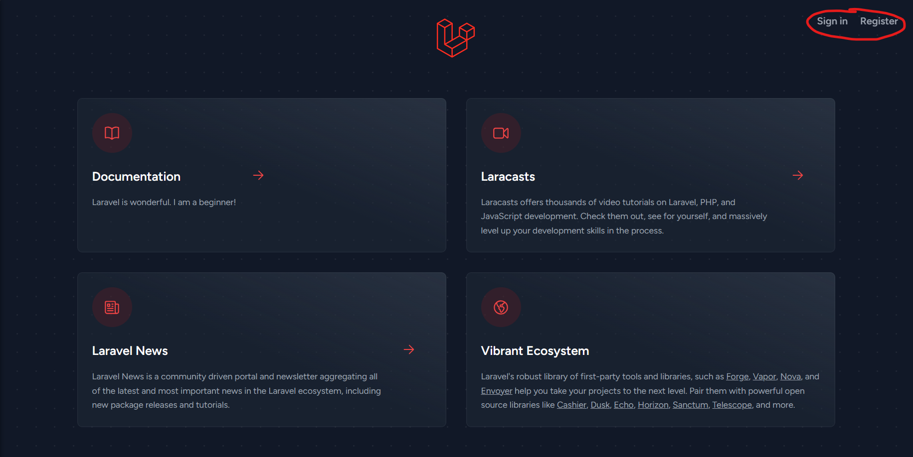

## About this project

This project is a demo web application built on Laravel. Laravel takes the pain out of development by easing common tasks used in many web projects, such as:

## Files
- [PHP tests config file](phpunit.xml)
- [NPM Dependencies](package.json)
- [PHP Dependencies](composer.json) 
  - Use `composer update` to update packages based on [composer.json](composer.json), and updates in [composer.lock](composer.lock).
- [PHP Dependencies (version LOCKED)](composer.lock)
  - Use `composer install` to install packages based on this file.
- [Vendor - PHP packages (like node module)](vendor/)
- [Artisan - Laravel console CLI](artisan)
  - Use `php artisan` for more details
- [Application Configurations](.env.example)
  - The actual *.env* file should not be exposed

## Simple Authentication
Using the official [Laravel Breeze](https://github.com/laravel/breeze) package, we can implement authentication features, from login, registration, password reset to email verification and password confirmation.

Installation, go to the application root folder or where the *composer.json* file resides. Execute the following command.

```sh
composer require laravel/breeze --dev
```

Once finished, we should see "laravel/breeze" being added in *composer.json*.
```json
    "require-dev": {
        "fakerphp/faker": "^1.9.1",
        "laravel/breeze": "^1.25",
        "laravel/pint": "^1.0",
        "laravel/sail": "^1.18",
        "mockery/mockery": "^1.4.4",
        "nunomaduro/collision": "^7.0",
        "phpunit/phpunit": "^10.1",
        "spatie/laravel-ignition": "^2.0"
    },
```
Next, we should run `breeze:install` command of *artisan*.

```sh
php artisan breeze:install
```

There will be many changes made on the existing files, along with some new files created.

For instance,
- [Tailwind css config](tailwind.config.js) is the configuration file for the tailwind CSS framework.
- [Postcss config](postcss.config.js) is the configuration file for postcss tool that transforms styles using JS plugins.
- [Auth views](resources/views/auth/) stores the views for authentication related actions like login, registration...
- [Auth routes](auth.php) implements the routing logic for authentication related actions.



Before we can use the authentication services, we must ensure the database is running. We can easily do this by running the command `php artisan migrate`.

**Note**: Make sure *a mysql server* is running and *php-mysql* is installed in the machine.

In this project, a mysql server was configured using [docker-compose.yaml](docker-compose.yaml).

```sh
docker compose up

# sudo apt-get install php<version>-mysql
sudo apt-get install php8.1-mysql
```

Also, ensure that the database configuration in the [.env](.env) file is correctly provided. Now run 

```sh
php artisan migrate
```

to create tables.

More information about migration, refer here [Database: Migrations - Laravel 10.x - The PHP Framework For Web Artisans](https://laravel.com/docs/10.x/migrations). In short, we can create other migrations using 

`php artisan make:migration create_tablename_table`, which will create a corresponding file at `database/migrations`.

## MVC Pattern

Laravel uses the Model-View-Controller (MVC) architecture pattern to manage data access control.

- **View**: The user interface part that renders based on the current model's state. It can also work as an interface to update or add new data to the models.

- **Controller**: A controller is the brain that connects the model and view. It handles requests and data flow. It can control what data is returned to the view or what actions are to be performed on the data before rendering or storage. For example, data validation or sanitisation.

- **Model**: Where the controller gets its data from. Usually performs the MYSQL CRUD. In Laravel, any class that extends `Model` will automatically match with a table named after the class name in plural form. It can also be explicitly defined using the `table` property of the class.

  ```php 
  class Order extends Model {
      protected $table = 'user_order'
  }
  ```

  ### SQL Querying

  Using the `Illuminate\Support\Facades\DB` library, we can perform SQL queries by passing statements to the provided functions.

  For example, a simple select query

  ```php
  # fetch all users
  $users = DB::select("select * from users");
  ```

  To query with conditions, remember to use binding to prevent SQLi attack.

  ```php
  # find user by name
  $users = DB::select("select * from users where name=?", ["jason"]);
  ```

  For insertion, use the `insert` function and similarly we can use binding to put variables into the statement safely.

  ```php
  # insert a new user
  id = 1;
  name = "Jim"
  $success = DB::insert("insert into users (id, name) values (?, ?)", [id, name]);
  
  # $success will return true if insert has no errors
  ```

  Another way to perform SQL queries to use the `table` function.

  ```php
  # Retrieving all user records
  $users = DB::table('users')->get();
  # To select columns
  $users = DB::table('users')->get(["name, email"]);
  # Where condition
  $users = DB::table('users')->where('name', '=', 'Dylon Wong Chung Yee')->get(["name", "email"]);
  # Get first user
  $users = DB::table('users')->first();
  # Find by id
  $users = DB::table('users')->find(1);
  # Chunking system...
  ```

  This omits the need to write the SQL statement every time.

  To learn more about SQL querying in Laravel, refer to [Database: Migrations - Laravel 10.x - The PHP Framework For Web Artisans](https://laravel.com/docs/10.x/migrations).


